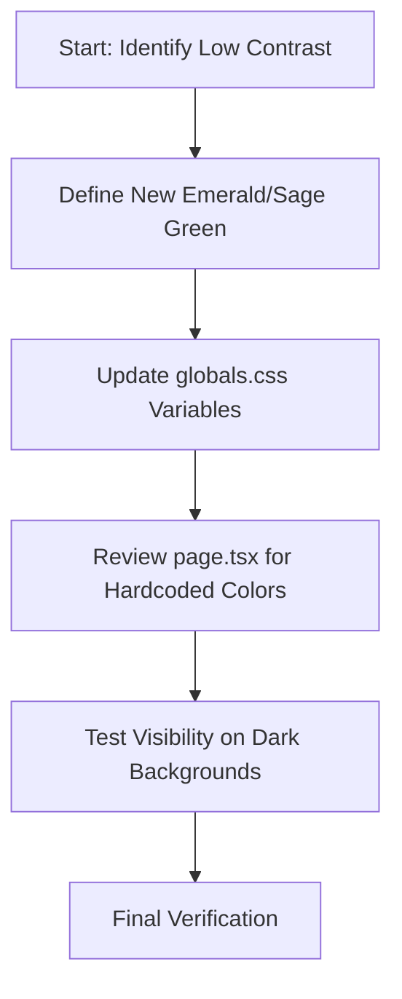

# Color Improvement Plan

## Analysis
The current `--primary-forest` (#064E3B) is a very dark green. On a dark background (#0f1714), it lacks sufficient contrast for readability, especially for users with vision impairments or on screens with lower brightness.

## Proposed Changes
I will introduce a new `--forest-bright` variable and update existing forest variables to be more visible.

### 1. Update `src/app/globals.css`
I'll update the variables to use a brighter, more "emerald/sage" palette:
- `primary-forest`: Change from #064E3B to **#10B981** (Tailwind Emerald 500) or **#34D399** (Emerald 400).
- `forest-medium`: Change from #065f46 to **#059669** (Emerald 600).
- `forest-dark`: Keep as #064E3B for background depths, but ensure text doesn't use it on dark backgrounds.

### 2. Update `src/app/page.tsx`
- Ensure the "NORTHWEST" span uses the updated `text-forest`.
- Check the "Services" section where "Additions", "Tile & Stone", and "Repairs" use `text-forest`. The brighter color will fix the "blending in" issue.

## Mermaid Workflow

